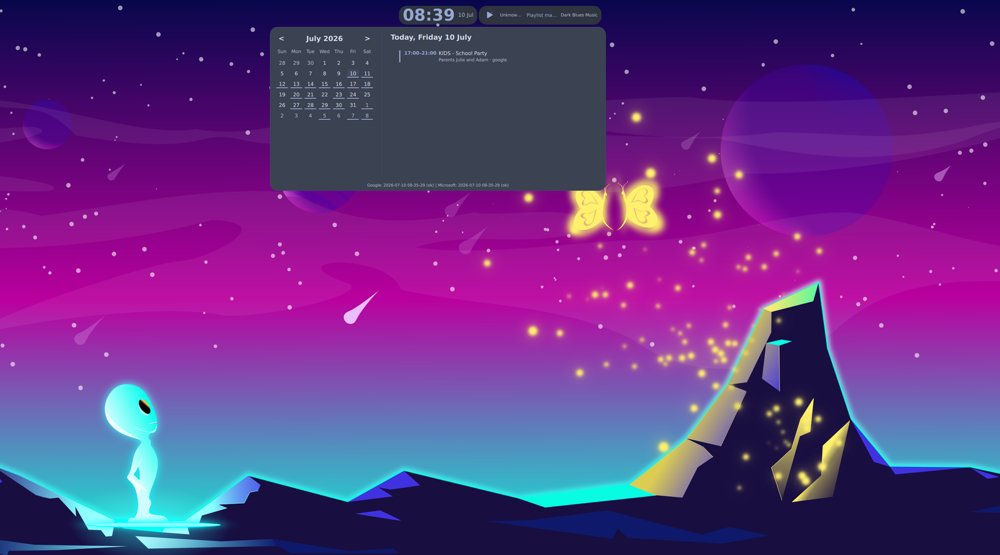
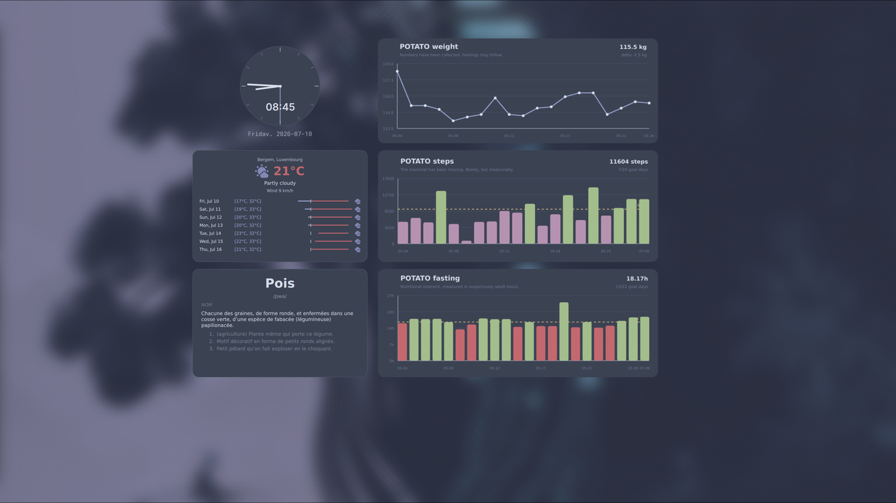
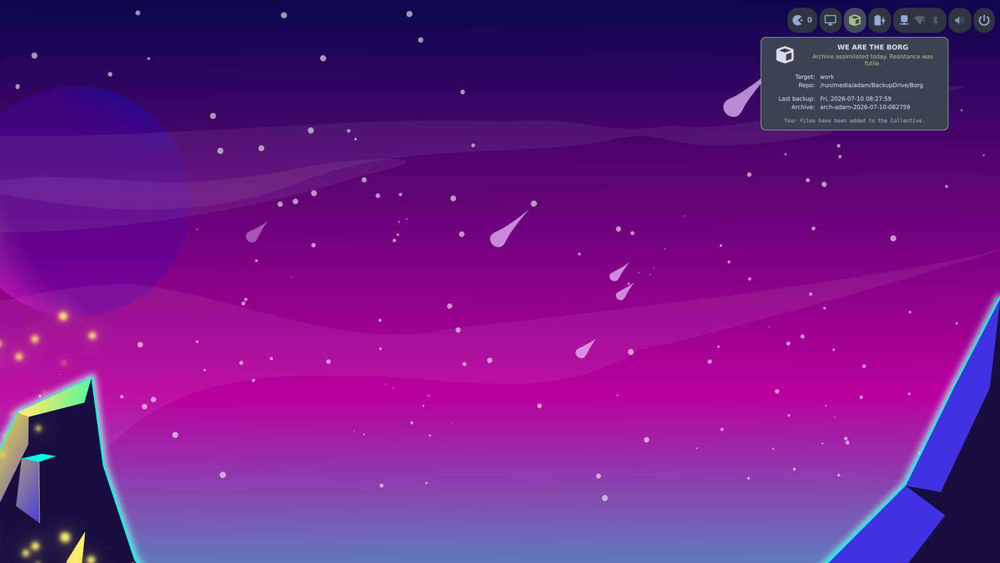
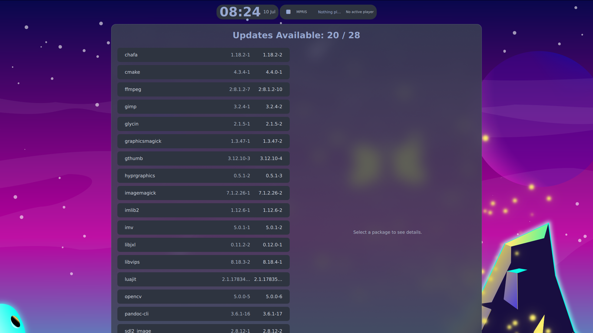
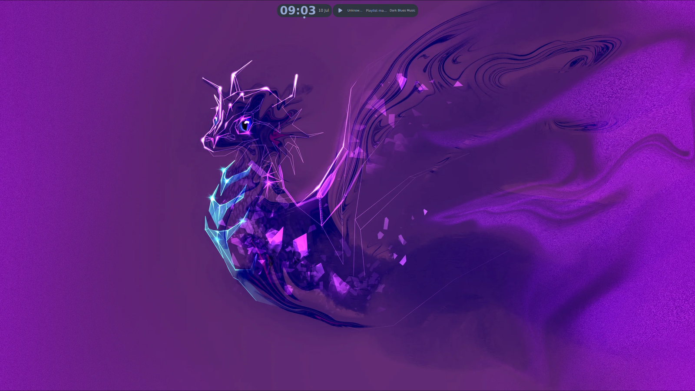
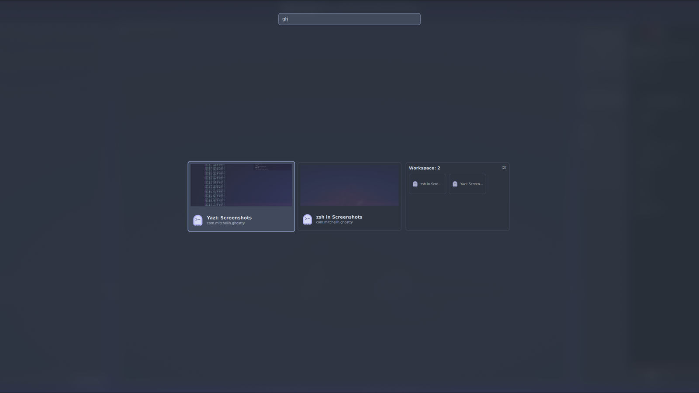
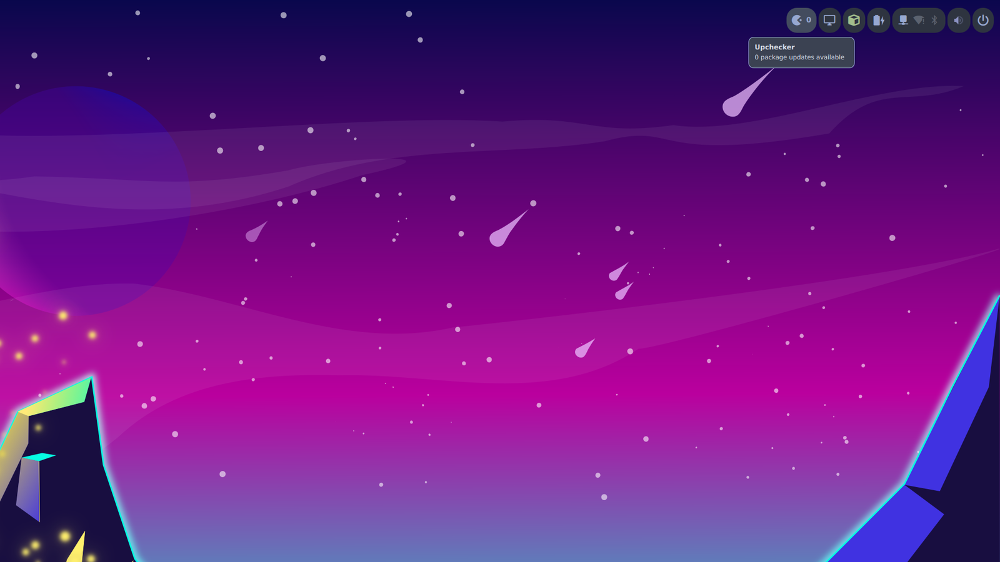
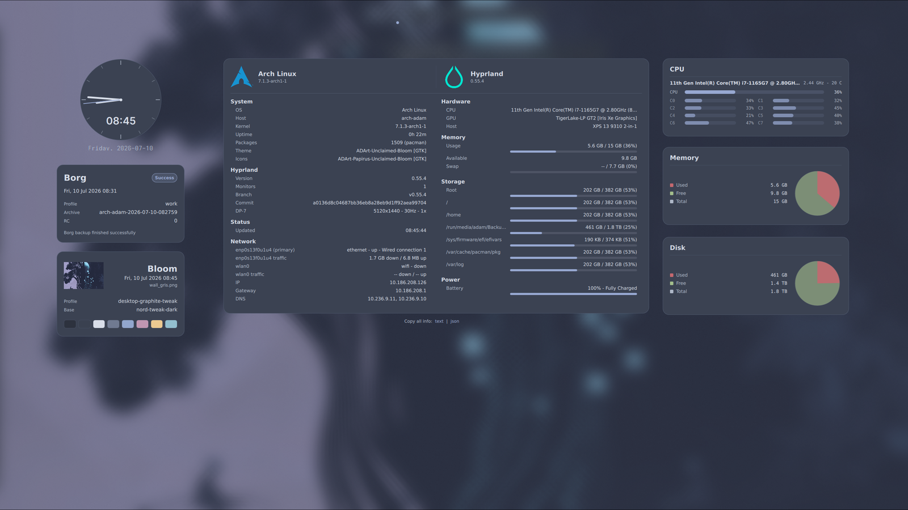

# Qreep

> A Quickshell-based desktop creature that is odd, small, memorable, slightly cursed, but friendly enough to become mine.

Qreep is my personal desktop shell for Hyprland.

It started as a Waybar-shaped learning project: one bar, a few pills, and the innocent belief that it would remain small. It has since grown into the place where I build the desktop surfaces I actually want to use — without trying to become a desktop environment, a universal framework, or a cathedral made entirely of QML.

<p align="center">
  <a href="docs/assets/videos/qreep-bar-cut.mp4">
    
  </a>
</p>

<p align="center">
  <em>A quiet desktop until I ask it to do something.</em><br>
  <a href="docs/assets/videos/qreep-bar-cut.mp4">▶ Watch the bar in motion</a>
</p>

## Why this creature exists

I like using things, but I also like understanding how they work.

Qreep is not an argument against Waybar, AGS, or somebody else's idea of a good desktop. Those projects helped me get here. This one exists because learning is fun, experimentation is useful, and sometimes the best way to understand a shell is to build your own slightly questionable version of it.

It is the continuation of many ideas from my older AGS setup, now rebuilt around Quickshell and allowed to grow in a direction that feels more mine.

## Qreep in motion

The images below are clickable. They open short demonstrations rather than two-minute documentaries about a popup.

| Dashboard and Aegis | Calendar |
| :---: | :---: |
| [](docs/assets/videos/qreep-dashboard-cut.mp4) | [](docs/assets/videos/qreep-calendar-cut.mp4) |
| [▶ Watch Dashboard and Aegis](docs/assets/videos/qreep-dashboard-cut.mp4) | [▶ Watch the calendar](docs/assets/videos/qreep-calendar-cut.mp4) |

| Workspaces | Unclaimed Bloom |
| :---: | :---: |
| [](docs/assets/videos/qreep-workspaces-switching-cut.mp4) | [](docs/assets/videos/qreep-un-bloom-cut.mp4) |
| [▶ Watch workspace switching](docs/assets/videos/qreep-workspaces-switching-cut.mp4) · [window view](docs/assets/videos/qreep-workspaces-windows-cut.mp4) | [▶ Watch the desktop change its clothes](docs/assets/videos/qreep-un-bloom-cut.mp4) |

## What lives here

### The bar

The daily visible part of Qreep includes:

- Hyprland workspaces;
- clock and calendar;
- MPRIS media controls;
- network, volume, battery, and power controls;
- launcher and monitor-profile controls;
- update checking;
- Borg backup state and progress.

The bar can run in `reserved`, `overlay`, or `collapsed` mode. Individual pills may also be enabled or expanded independently, because apparently even a bar can have moods.

| Small moving part | Short demo |
| --- | --- |
| Bar modes and behaviour | [▶ Watch](docs/assets/videos/qreep-bar-cut.mp4) |
| MPRIS controls | [▶ Watch](docs/assets/videos/qreep-mpris-cut.mp4) |
| Borg backup state and progress | [▶ Watch](docs/assets/videos/qreep-borg-cut.mp4) |
| Monitor profiles | [▶ Watch](docs/assets/videos/qreep-monitorprofiles-cut.mp4) |

### Larger shell surfaces

Some things are too large to pretend they are bar widgets:

- **Expose** — a searchable, keyboard-friendly window overview;
- **Clipboard** — clipboard history with search and selection;
- **Notifications** — transient popups and a grouped notification centre;
- **OSD** — quiet on-screen feedback for volume and other shell messages;
- **Dashboard** — a larger surface for useful blocks and experiments;
- **Aegis** — system information and monitoring;
- **Bloom** — progress feedback for my Unclaimed Bloom tooling.

They live as their own modules. The bar is allowed to open them, but it is not allowed to adopt all of them.

| Expose | Notifications |
|:---:|:---:|
|  |  |

| Dashboard | Aegis |
|:---:|:---:|
| [](docs/assets/videos/qreep-dashboard-cut.mp4) | [](docs/assets/videos/qreep-dashboard-cut.mp4) |

### A clock that became a calendar

The clock popup grew into a calendar with local events, Google Calendar and Outlook/Microsoft calendar pulls, reminders, event dots, and change feedback.

This was not necessarily the plan. It is, however, useful.

<p align="center">
  <a href="docs/assets/videos/qreep-calendar-cut.mp4">
    
  </a>
</p>

<p align="center">
  <a href="docs/assets/videos/qreep-calendar-cut.mp4">▶ Watch the calendar</a>
</p>

## The rules, approximately

Qreep follows a few practical rules:

- useful before universal;
- understandable before clever;
- personal before configurable for every hypothetical computer;
- small controls may live in the bar;
- larger surfaces must earn their own space;
- animations are welcome, provided they do not make the desktop drunk;
- learning is part of the purpose;
- the repository is allowed to grow, but not into a framework with feelings.

## Current condition

Qreep is alive, used, and still changing.

It is a personal configuration rather than a polished drop-in product. You are welcome to inspect it, borrow ideas, reuse pieces, or adapt it to your own desktop. Running the whole thing unchanged may also import several assumptions about my monitor layout, scripts, backups, calendars, and tolerance for animated details.

That seems unfair to both of us.

## Start

Install the helper scripts and user units:

```bash
scripts/install
```

Run Qreep:

```bash
quickshell -c qreep
```

For relaunching during development without accidentally spawning another copy:

```bash
quickshell -c qreep --no-duplicate
```

## A few useful IPC calls

```bash
quickshell ipc call qreep-bar setMode reserved
quickshell ipc call qreep-bar setMode overlay
quickshell ipc call qreep-bar setMode collapsed

quickshell ipc call qreep-expose toggle
quickshell ipc call qreep-clipboard toggle
quickshell ipc call qreep-notification toggleCenter
quickshell ipc call qreep-dashboard toggle
quickshell ipc call qreep-aegis toggle

quickshell ipc call osd showMessage "Qreep lives, somehow" 3000
```

Some Quickshell versions vary slightly in CLI syntax. When IPC becomes philosophical:

```bash
quickshell ipc --help
```

## Where things live

```text
shell.qml                  top-level shell entry

modules/bar/               the bar
modules/bar/features/      bar-owned pills, services, and popups

modules/aegis/             system dashboard
modules/bloom/             Bloom progress surface
modules/clipboard/         clipboard picker
modules/dashboard/         dashboard engine and surface
modules/expose/            window overview
modules/notification/      notification server, popups, and centre
modules/osd/               on-screen display

components/                shared UI pieces
core/                      shared shell machinery
theme/                     public theme entry point and tokens
scripts/                   helpers and user services
```

## Documentation

This README is the lobby, not the municipal archive.

For the longer map — module inventory, theme notes, IPC details, layer rules, calendar setup, and the things future Adam will need after pretending he remembers everything — see [`README_when_bored.md`](README_when_bored.md).

## Why “Qreep”?

Because it is odd, small, memorable, slightly cursed, and somehow became mine.
